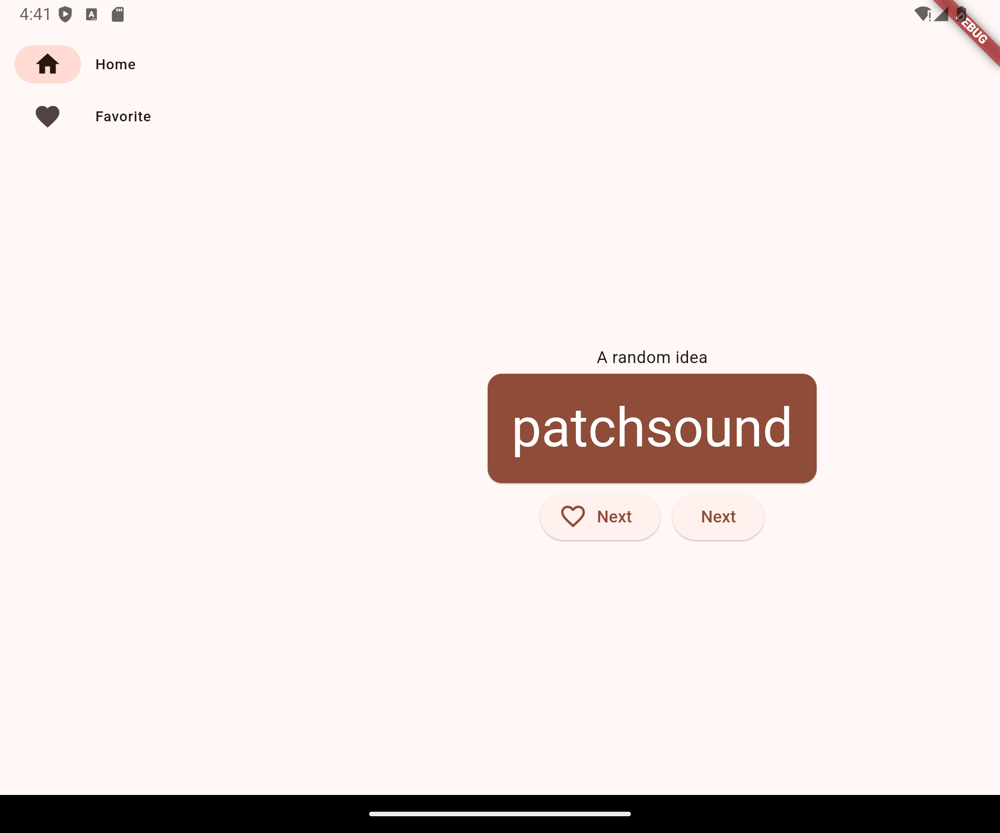

# namer_app

Flutter est un kit d'interface utilisateur (UI) Google qui permet de créer des applications pour les mobiles, le Web et les ordinateurs à partir un même codebase. Dans cet atelier de programmation, vous allez développer l'application Flutter suivante :

L'application génère des noms chantants, comme "newstay", "lightstream", "mainbrake" ou "graypine". L'utilisateur peut accéder au nom suivant, mettre le nom affiché en favori et consulter la liste de ses noms préférés dans une autre page. L'application est responsive aux différentes tailles d'écran.

## Les fonctionnalites 

- Fonctionnement de base de Flutter
- Créer des mises en page sous Flutter
- Associer les interactions utilisateur (appuis de bouton, par exemple) aux comportements de l'application
- Assurer l'organisation du code Flutter
- Rendre l'application responsive (aux différents écrans)
- Proposer une interface homogène

## Les Platformes

- Android
- Linux

## Pour votre lecture 

- [Lab: Write your first Flutter app](https://docs.flutter.dev/get-started/codelab)
- [Cookbook: Useful Flutter samples](https://codelabs.developers.google.com/codelabs/flutter-codelab-first?hl=fr#0)
